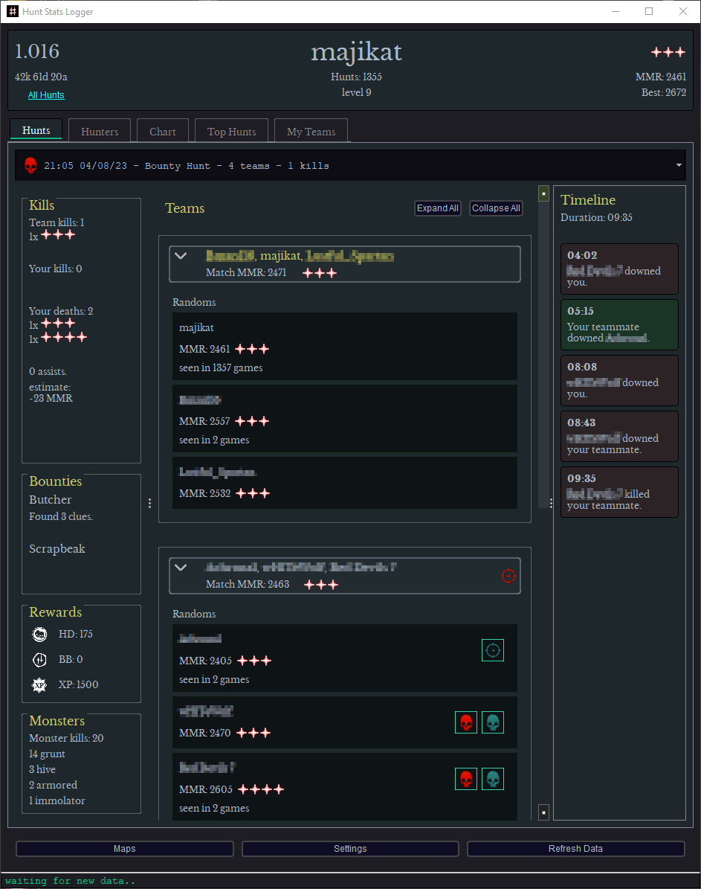
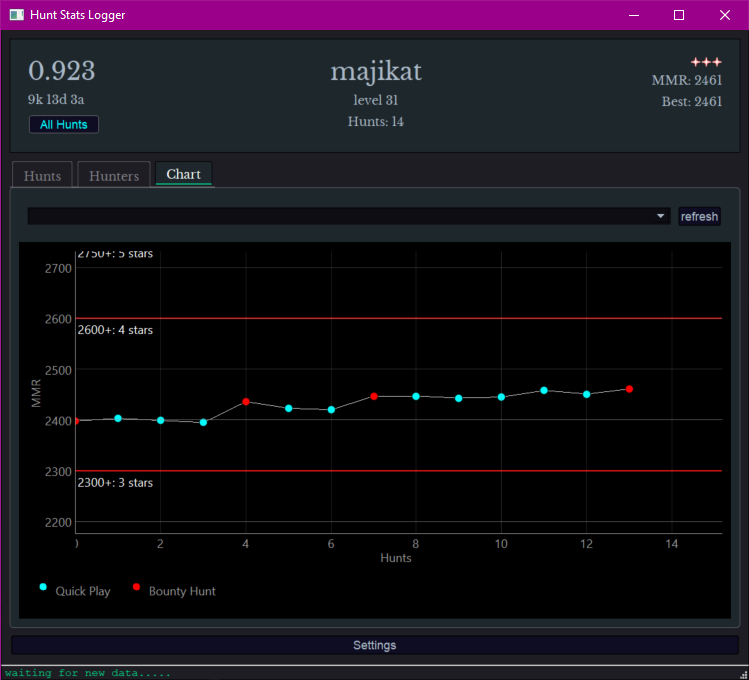

# Hunt Stats Logger

<p>
  
  
</p>

<p>
This program was made to record hunt statistics in the game <b>Hunt: Showdown</b>.
<br>It works by tracking changes in the attributes.xml file, which is updated after every Hunt, logging those changes to a local .json file, and uploading them to a local sqlite database.
<p>
Data for the beetle spawn locations in the maps is from <a href="https://steamcommunity.com/sharedfiles/filedetails/?id=2876319397">RinLove's Steam Guide</a>.
</p>
<p>
App has to be running for hunts to be logged.
</p>

When running the app for the first time, click on Settings, Select Hunt Install Directory, and choose your Hunt install directory ( something like C:/Steam/steamapps/common/Hunt Showdown ) .
Then click Change Steam Name, enter your Steam username and press Enter.

# How to run

Currently I recommend running it directly as a Python script, as the executable is getting incorrectly flagged as a virus by Windows.

Otherwise, you can try downloading the latest version from the <a href="https://github.com/majikat768/HuntStatsLogger/releases">Releases</a>. You may need to add an exception in Windows Defender.

#

## To run script directly:

### You'll need to have Python3 and pip installed. Get Python3 <a href="https://www.python.org/downloads/windows/">here</a>. Pip should be included.

<p>To verify they're installed, open a cmd prompt or PowerShell, and execute `python --version; pip --version` which will output the version you have installed.</p>

open a PowerShell or cmd prompt, navigate to the git directory, and execute:

```
$ pip install -r requirements.txt;  python ./src/main.py
```

Alternatively, right click on <b>startapp.ps1</b> and choose <b>Run with PowerShell</b>, which will automatically execute the above command.

( I'm not associated with Crytek or Hunt Showdown in any way. This program is free and open source software. )
