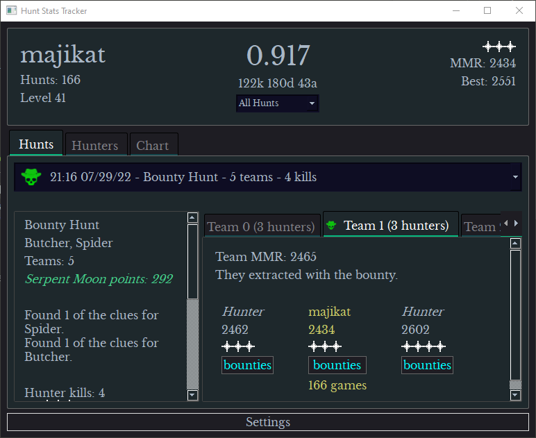

# Hunt Stats Logger

<p>
This program was made to record hunt statistics in the game <b>Hunt: Showdown</b>.
<br>It works by tracking changes in the attributes.xml file, which is updated after every game, logging those changes to a local .json file, and uploading them to a local sqlite database.
</p>
<p>
To run it, you'll need to have Python3 and pip installed.
</p>
<p>
App has to be running for hunts to be tracked.
</p>

### When running the app for the first time, click on Settings, Select Folder, and choose your Hunt install directory ( something like C:/Steam/steamapps/common/Hunt Showdown ) .
### Then enter your Steam username and click Update Steam Name.
### The app should populate with data from your last Hunt. It will update automatically after returning to the Game lobby after every subsequent Hunt (as long as the app is still running).
#
# How to run
## Easiest method, maybe:
<ol>
<li>Right click on <b>build.ps1</b>, and choose <b>Run with PowerShell</b>.
<li>Open <b>HuntStats.exe</b>.
</ol>

#
## To run script directly:
from root directory, execute:
```
$ pip install -r requirements.txt;  python ./src/main.py
```

#
## To build executable:
```
$ pip install -r requirements.txt; pyinstaller main.spec
```
executable will then be found at ./dist/main/main.exe
#


