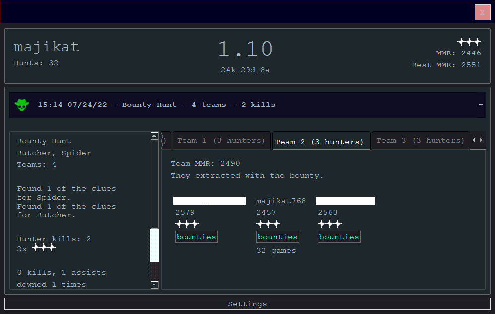

### When running the app for the first time, click on Settings, Select Folder, and choose your Hunt install directory ( something like C:/Steam/steamapps/common/Hunt Showdown ) .
### Then enter your Steam username and click Update Steam Name.
### The app should populate with data from your last Hunt. It will update automatically after returning to the Game lobby after every subsequent Hunt (as long as the app is still running).
#
# How to run
from root directory, execute:
```
$ pip install -r requirements.txt;  python ./src/main.py
```

#
# How to build executable:
```
$ pip install -r requirements.txt; pyinstaller main.spec
```
executable will then be found at ./dist/main/main.exe
#


